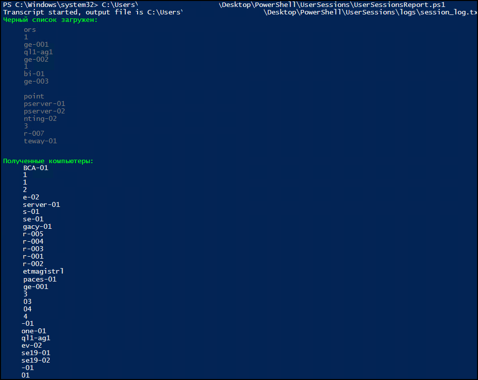

# UserSessions
Данный PowerShell-скрипт автоматизирует процесс сбора информации об активных пользовательских сессиях на компьютерах в домене Active Directory. 
Скрипт разработан как инструмент для системных администраторов с возможностью логирования, фильтрации и формирования отчета по результатам в виде HTML-таблицы с последующей отправкой по электронной почте.

<b>Важно: Для успешной работы скрипта на целевых (удалённых) компьютерах должен быть включён и настроен WinRM (Windows Remote Management).</b>

Основные функции и возможности:
- Анализ компьютеров AD — получение списка машин, исключение OU Computers и устройств из blacklist.txt, поддержка параметра -ComputerName.
- Проверка сессий — удалённый опрос по WinRM (Kerberos), выполнение query user, формирование списка активных/отключённых пользователей.
- Логирование — запись и очистка логов (logs\session_log.txt), структурирование ключевых событий.
- Email-отчёт — HTML-таблица с результатами и логами, отправка через SMTP с поддержкой UTF-8.

## Скриншоты

### Вывод результатов (CLI)

### Отчет на почту 
